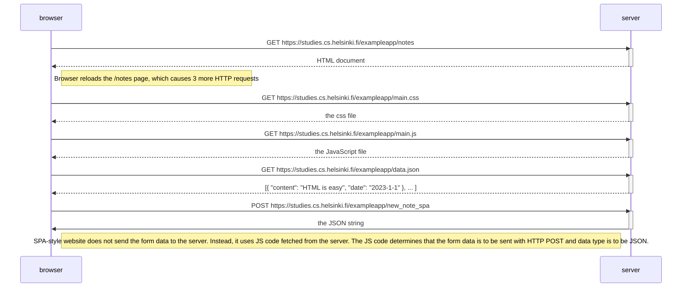

0.5: Single Page app diagram

FIRST, LOADING THE WEB PAGE

1. HTTP GET: html file
2. HTTP GET: css, js, json

THEN, HTTP POST

1. HTTP POST: /new_note_spa =>
   - Note: server responds to HTTP POST with status code 201 instead of 302. hence, it does not execute URL-redirect, and instead stays on the same page.

? Single-page application (SPA)

- traditional webpage: all of the logic is on the server, and the browser only renders the HTML as instructed
- SPA-style websites: they don't fetch their pages separately from the server. they comprise of only one HTML page fetched from the server, then the browser manipulates the contents of the page using JavaScript.
