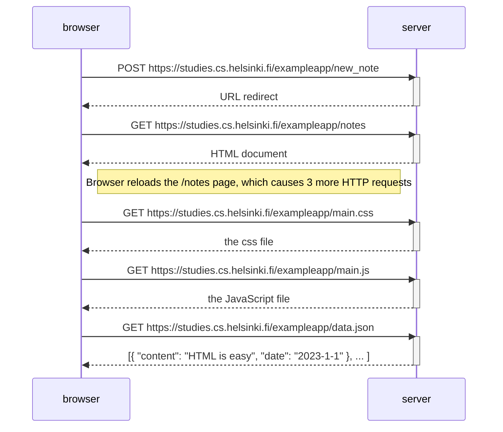

sequenceDiagram
    participant browser
    participant server
    
    browser->>server: POST https://studies.cs.helsinki.fi/exampleapp/new_note
    activate server
    server-->>browser: URL redirect
    deactivate server

    browser->>server: GET https://studies.cs.helsinki.fi/exampleapp/notes
    activate server
    server-->>browser: HTML document
    deactivate server

    Note right of browser: browser reloads the /notes page, which causes 3 more HTTP requests

    browser->>server: GET https://studies.cs.helsinki.fi/exampleapp/main.css
    activate server
    server-->>browser: the css file
    deactivate server

    browser->>server: GET https://studies.cs.helsinki.fi/exampleapp/main.js
    activate server
    server-->>browser: the JavaScript file
    deactivate server

    browser->>server: GET https://studies.cs.helsinki.fi/exampleapp/data.json
    activate server
    server-->>browser: [{ "content": "HTML is easy", "date": "2023-1-1" }, ... ]
    deactivate server

FIRST, LOADING THE WEB PAGE

1. Browser fetches HTML code using HTTP GET request
2. Links in HTML code causes browser to fetch "main.css" (the stylesheet) and "main.js" (javascript code)
3. browser executes JS code
4. JS code makes a HTTP GET request to exampleapp/data.json, which returns JSON data
5. browser executes an event handler, rendering the notes from JSON data to the page using DOM-API.
   ?  --> I'm assuming this handler comes into use when i enter something into the empty field and press 'Save'.
       --> this happens later. steps 1-5 are only for loading the webpage, and don't describe what happens when a user enters something into the textfield and saves it. so basically in the last step, the event handler is "created" I think, then it just waits for the right event from the user.

NEXT, FORMS & HTTP POST

1. HTTP POST request to address "/new_note" (i.e. "/exampleapp/new_note")
2. server responds with HTTP status code 302 => URL redirect => browser does a HTTP GET request to the address "/notes"
-  the code specifying the HTTP POST request is found on the SERVER, not in the JS code that was fetched by the browser.
   
3. hence browser reloads the "/notes" page.
4. the reload causes 3 more HTTP requests: main.css, main.js, data.json

? DOM-API

Document Object Model, or DOM, is an Application Programming Interface (API) that enables programmatic modification of the element trees corresponding to web pages.

JavaScript code can use the DOM-API to add a list of notes to the page.

? Understanding clients, servers, browsers, and their relationship

https://www.geeksforgeeks.org/client-server-model/# (SEE BELOW)

- Client: a computer (Host) capable of receiving information or using a particular service from the service providers (Servers).

- Servers: a remote computer which provides information (data) or access to particular services.

- How do servers and browsers communicate? --> HTTP. (for more, see this: https://developer.mozilla.org/en-US/docs/Web/HTTP)

?

